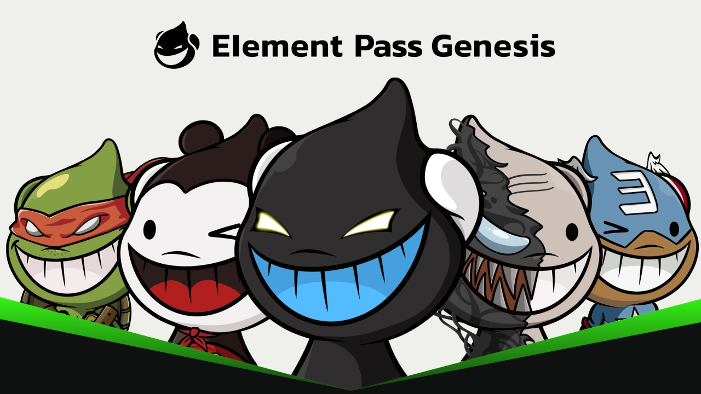

# Element NFT 权益卡介绍 
**Element Pass** 是为 [ELE DAO](https://eledao.io) 成员和 [Element](https://element.market) 社区用户发行的带权益属性的 NFT 集合，作为一个平台权益系列，简称 EP，其中包括 EPG 和 EPS 两种类型的权益卡。持有者有机会参与到 Element 可能带给 Web3 的革命性创新的过程中来，同时，通过追随 Element 及使用 Element Web3 产品，来获得超级奖励。

Element 创世权益卡（Element Pass Genesis），简称 **EPG**。

Element 标准权益卡（Element Pass Standard），简称 **EPS**。

> 注：EPS 6月份开图。

||EPG|EPS|
|:--:|:--:|:--:|
|定义|Element 社区用户创世 NFT 权益卡|Element 社区用户标准 NFT 权益卡|
|功能|治理 & 质押 & 生态空投 & 产品特权|治理 & 质押 & 生态空投 & 产品特权|
|场景|创世 NFT 权益卡作为平台权益的价值锚定。|随着用户忠诚度增长的增益 NFT 权益卡|

**EPG 权益**

- ELEDAO 创世成员身份；
- 内测资格、NFT 质押（获取 $ELE token）；
- 享有与 VIP4用户同等的权利、费用折扣及回扣；
- 获得生态系统伙伴的白名单及 Token 空投；
- 有机会获得 Launchpad 项目的空投和幸运抽奖。

**EPS 权益**

- ELEDAO 成员身份；
- 内测资格；
- NFT 质押（获取 $ELE token）；
- 拥有 EPS 来增强用户忠诚度以获得更多的 $ELE 令牌空投；
- 享有与 VIP4用户同等的权利；
- 有机会获得生态系统伙伴的Token、NFT、白名单等空投。 

**总结**

简单点说，EPG 是 To B， 面向生态系统伙伴（平台的合作方）；而 EPS 则是 To C，面向社区用户（平台的消费者），带有用户激励属性在，增加用户对平台的忠诚度、活跃度，通过这些忠诚度计划（NFT 挂单、NFT 交易等等）让持有者获得相应的奖励。

## EP 系列之 EPG

生态合作伙伴入驻
|项目名|项目类型|官宣时间| NFT 编号| 成本价(E)|稀有排名|拥有者|
|:--:|:--:|:--:|:--:|:--:|:--:|:--:|
|[Debox](https://debox.pro/)|Web3 社交|2023/3/31 [推特](https://twitter.com/DeBox_Social/status/1641707256919265280?s=20)|[#190](https://element.market/assets/ethereum/0x67405cadb820c2d89b8d6da3e42ef6a39089c831/190)|0.317|1752|[DeBox_Social](https://element.market/account/0x36ff2468daa79f52d88d7359a631cf7ab4bdc8bb)|
|[Baby Wealthy Club](https://babywealthyclub.com/)|BNB 生态|2023/4/1 [推特](https://twitter.com/BabyWealthyClub/status/1642055523674771461?s=20)|[#51](https://element.market/assets/ethereum/0x67405cadb820c2d89b8d6da3e42ef6a39089c831/51)|0.18|1318|[0x64b...0587](https://element.market/account/0x64bbd415477825825602373232121a3034a20587)|
|[BabySwap](https://home.babyswap.finance/)|BNB 生态|2023/4/3 [推特](https://twitter.com/babyswap_bsc/status/1642845900551909376?s=20)|[#380](https://element.market/assets/ethereum/0x67405cadb820c2d89b8d6da3e42ef6a39089c831/380)|0.18|521|[0x226...33f0](https://element.market/account/0x226139dcf98fef608f1fa0edebd6f799f3df33f0)|
|[MixVerse](https://www.mixverse.com/)|元宇宙|2023/4/16 [推特](https://twitter.com/Mixverse_/status/1647525243404316673?s=20)|[#582](https://element.market/assets/ethereum/0x67405cadb820c2d89b8d6da3e42ef6a39089c831/582)|0.296|141|[0xb6c...2c69](https://element.market/account/0xb6c185420522005efb2be3172bd1ac30b9a12c69)|
|[PlurDAO](https://plur.io/)|3D NFT|2023/4/19 [推特](https://twitter.com/PLUR_DAO/status/1648662230064582657?s=20)|[#282](https://element.market/assets/ethereum/0x67405cadb820c2d89b8d6da3e42ef6a39089c831/282)|0.18|126|[0xcb2...e204](https://element.market/account/0xcb2fdb77c60bb4aad4ed71804fc403f1e650e204)|
|[Plant Crossing](https://plant-crossing.com/)|游戏&社交|2023/4/20 [推特](https://twitter.com/PlantCrossing22/status/1648951116728791042?s=20)|[#1432](https://element.market/assets/ethereum/0x67405cadb820c2d89b8d6da3e42ef6a39089c831/1432)|0.636|145|[0xbfe...7f3e](https://element.market/account/0xbfe1851d851700d64b0c4cfdeb5fff1b88ab7f3e)|
|[Kepler](https://kepler.homes/)|游戏|2023/4/21 [推特](https://twitter.com/KeplerHomes/status/1649319423252254720?s=20)|[#637](https://element.market/assets/ethereum/0x67405cadb820c2d89b8d6da3e42ef6a39089c831/637)|0.56|199|[0x326...dd99](https://element.market/account/0x326b0a86e6fe24d781f3779191ec8c42bd2ddd99)|
|[Star Protocol](https://star.co/)|社交|2023/4/24 [推特](https://twitter.com/star_protocol/status/1650412888136495105?s=20)|[#499](https://element.market/assets/ethereum/0x67405cadb820c2d89b8d6da3e42ef6a39089c831/499)|0.579|2095|[0xa17...90a5](https://element.market/account/0xa17abe4b6fc3023521da65581424ce35a9d290a5)|
|[Abyss World](https://www.abyssworld.games/)|游戏|2023/4/26 [推特](https://twitter.com/AbyssWorldHQ/status/1651107460181295104?s=20)|[#1285](https://element.market/assets/ethereum/0x67405cadb820c2d89b8d6da3e42ef6a39089c831/1285)|0.215|1016|[0x772...1604](https://element.market/account/0x772ce7aa48558e8e31878fe79890d38f857f1604)|
|[Legend of Arcadia](https://legendofarcadia.io/)|游戏|2023/5/8 [推特](https://twitter.com/LegendofArcadia/status/1655551297880481792?s=20)|[#281](https://element.market/assets/ethereum/0x67405cadb820c2d89b8d6da3e42ef6a39089c831/281)|0.18|710|[0xcb2...e204](https://element.market/account/0xcb2fdb77c60bb4aad4ed71804fc403f1e650e204)|
|[YuriAI](http://yuri-ai.com)|AIGC|2023/5/9 [推特](https://twitter.com/YuriAI_Official/status/1655868292949774337?s=20)|[#1538](https://element.market/assets/ethereum/0x67405cadb820c2d89b8d6da3e42ef6a39089c831/1538)|0.65|1909|[0xb18...2393](https://element.market/account/0xb189f02e4a75fdff156ed077a6597d74349d2393)|
|[Foresight News](https://foresightnews.pro)|资讯|2023/5/11 [推特](https://twitter.com/Foresight_News/status/1656570041381552132?s=20)|[#1279](https://element.market/assets/ethereum/0x67405cadb820c2d89b8d6da3e42ef6a39089c831/1279)|0.18|970|[0xa33...cef1](https://element.market/account/0xa331a3bafb586a4d65dce579f220dfbd5ac8cef1)|
|HOLO 研究院|研究|2023/5/13 [推特](https://twitter.com/holoinst/status/1657390416923344899?s=20)|[#1051](https://element.market/assets/ethereum/0x67405cadb820c2d89b8d6da3e42ef6a39089c831/1051)|0.18|237|[0x511...c89d](https://element.market/account/0x511b85366451f24d998a7cabeb590a7f6465c89d)|
|[Gameta](https://www.gameta.pro)|游戏|2023/5/15 [推特](https://twitter.com/Gameta_Official/status/1658079789591277572?s=20)|[#956](https://element.market/assets/ethereum/0x67405cadb820c2d89b8d6da3e42ef6a39089c831/956)|0.65|981|[0xf5b...98b2](https://element.market/account/0xf5b46f33f41b1a020d0bbbfcda9c0e93cb3598b2)|
|[Zksync Doge](http://zkdoge.org/)|NFT|2023/5/16 [推特](https://twitter.com/zksync_doge/status/1658356643669889025?s=20)|[#1853](https://element.market/assets/ethereum/0x67405cadb820c2d89b8d6da3e42ef6a39089c831/1853)|0.425|2016|[0x38f...3cc0](https://element.market/account/0x38fc3840f17b444d8a7a954ae70cd276d12e3cc0)|
|[-]()|-|2023/ [推特](-)|[#](https://element.market/assets/ethereum/0x67405cadb820c2d89b8d6da3e42ef6a39089c831/)|0.18|-|[0x...]()|
## EP 系列之 EPS
